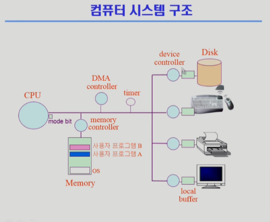

## 컴퓨터 시스템 구조

-   CPU
    -   매 클럭마다 메모리에서 인스터럭션 읽고 실행

## Mode bit

사용자 프로그램의 잘못된 수행으로 다른 프로그램 및 운영체제에 피해가 가지 않도록 하기 위한 보호 장치

-   mode bit 통해 하드웨어적으로 두 가지 operation 모드 지원
    -   1 : 사용자 모드
        -   사용자 프로그램 수행
    -   0 : 모니터/커널/시스템 모드
        -   OS 코드 수행

## Timer

정해진 시간이 흐르면 운영체제에 제어권이 넘어가도록 인터럽트를 발생시킴

-   매 클럭 틱 때마다 1씩 감소
-   값이 0이 되면 타이머 인터럽트 발생
-   특정 프로그램의 CPU 독점을 방지
-   time sharing 구현에 널리 사용됨
-   현재 시간 계산에도 사용됨

## Device Controller

-   I/O device controller
    -   해당 I/O 장치 유형을 관리하는 일종의 작은 CPU
    -   제어 정보 위해 control register, status register 보유
        -   CPU가 device에 작업을 지시하기 위한 register
    -   local buffer 보유 (일종의 data register)
        -   device에서 담은 데이터를 메모리에 넘겨주거나 메모리의 데이터를 device에 출력하기 위한 register
        -   예) 메모리의 데이터를 모니터의 local buffer에 담은 뒤 제어 register 통해 화면 출력 지시
-   I/O는 실제 device와 local buffer 사이에서 일어남
-   Device controller는 I/O가 끝났을 경우 interrupt로 CPU에 그 사실을 알림

> device driver (장치 구동기)

-   OS 코드 중 device 처리를 위해 각 device 인터페이스에 맞게 접근할 수 있게 해주는 software 모듈

## DMA controller

Direct Memory Access controller

-   CPU만 접근이 가능한 메모리에 접근할 수 있음
    -   memory controller
        -   메모리 접근 순서 등 관리
        -   특정 메모리 동시 접근 문제 방지
-   CPU에 대한 과다 interrupt 방지
    -   device의 local buffer 작업이 끝나면 DMA controller가 직접 메모리에 복사 후 CPU에 interrupt 발생

## 입출력(I/O)의 수행

-   모든 입출력 명령은 특권 명령
-   사용자 프로그램은 어떻게 I/O를 하는가?
    -   시스템콜
        -   사용자 프로그램은 운영체제에게 I/O 요청
    -   trap을 사용해 인터럽트 벡터의 특정 위치로 이동
    -   제어권이 인터럽트 벡터가 가리키는 인터럽트 서비스 루틴으로 이동
    -   올바른 I/O 요청인지 확인 후 I/O 수행
    -   I/O 완료 시 제어권을 시스템콜 다음 명령으로 옮김

## 인터럽트 Interrupt

인터럽트 당한 시점의 레지스터와 program counter를 save 한 후 CPU의 제어를 인터럽트 처리 루틴에 넘김

-   Interrupt (하드웨어 인터럽트)
    -   하드웨어가 발생시킨 인터럽트
-   Trap (소프트웨어 인터럽트)
    -   Exception : 프로그램이 오류를 일으킨 경우
    -   System Call : 프로그램이 커널 함수를 호출하는 경우

> 인터럽트 벡터

-   해당 인터럽트의 처리 루틴 주소를 가짐

인터럽트 처리 루틴

-   Interrupt Service Routine, 인터럽트 핸들러
-   해당 인터럽트를 처리하는 커널 함수

## 시스템 콜 System Call

사용자 프로그램이 운영체제의 서비스를 받기 위해 커널 함수를 호출하는 것

## 출처

https://core.ewha.ac.kr/publicview/C0101020140311132925816476?vmode=f