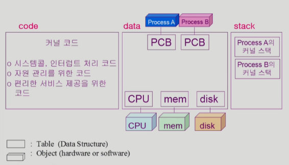

## 동기식 입출력과 비동기식 입출력

I/O의 완료는 인터럽트로 알려줌

### 동기식 입출력

-   I/O 요청 후 입출력 작업이 완료된 뒤에 제어가 사용자 프로그램에 넘어감
-   구현 방법1
    -   I/O가 끝날 때까지 CPU 낭비
    -   매 시점 하나의 I/O만 일어날 수 있음
-   구현 방법2
    -   I/O가 완료될 때까지 해당 프로그램으로부터 CPU 빼앗음
    -   I/O 처리를 기다리는 줄에 그 프로그램을 대기시킴
    -   다른 프로그램에게 CPU 할당

### 비동기식 입출력

-   I/O가 시작된 후 입출력 작업이 끝나기를 기다리지 않고 제어가 사용자 프로그램에 즉시 넘어감

## 서로 다른 입출력 명령어

-   I/O를 수행하는 special instruction에 의해
-   Memory Mapped I/O에 의해

## 저장장치 계층 구조

## 프로그램의 실행 (메모리 load)

## 커널 주소 공간의 내용

## 사용자 프로그램이 사용하는 함수

-   사용자 정의 함수
    -   자신의 프로그램에서 정의한 함수
-   라이브러리 함수
    -   자신의 프로그램에서 정의하지 않고 갖다 쓴 함수
    -   자신의 프로그램의 실행 파일에 포함돼 있다
-   커널 함수
    -   운영체제 프로그램의 함수
    -   커널 함수의 호출 = 시스템 콜

## 프로그램의 실행

## 출처

https://core.ewha.ac.kr/publicview/C0101020140314151238067290?vmode=f